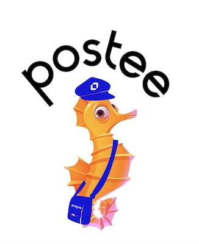

# Postee



![Docker Pulls][docker-pull]
[![Coverage Status][cov-img]][cov]
[![Go Report Card][report-card-img]][report-card]

[![License][license-img]][license]

[download]: https://img.shields.io/github/downloads/aquasecurity/postee/total?logo=github
[release-img]: https://img.shields.io/github/release/aquasecurity/postee.svg?logo=github
[release]: https://github.com/aquasecurity/postee/releases
[docker-pull]: https://img.shields.io/docker/pulls/aquasec/postee?logo=docker&label=docker%20pulls%20%2F%20postee
[go-doc-img]: https://godoc.org/github.com/aquasecurity/postee?status.svg
[cov-img]: https://codecov.io/github/aquasecurity/postee/branch/main/graph/badge.svg
[cov]: https://codecov.io/github/aquasecurity/postee
[report-card-img]: https://goreportcard.com/badge/github.com/aquasecurity/postee
[report-card]: https://goreportcard.com/report/github.com/aquasecurity/postee
[license-img]: https://img.shields.io/badge/License-mit-blue.svg
[license]: https://github.com/aquasecurity/postee/blob/master/LICENSE

## Description

A simple container for enhancing the available outputs for Aqua Security.
Postee can send a message to variety of target systems one a new image vulnerability is discovered.
The supported systems are: JIRA, Email, Slack, Microsoft Teams, Generic WebHook, Splunk and ServiceNow.

## Main Features
Some features that Postee provides:

1. Image rescans: When an image is rescanned, the integration will not send a message if the scan results are same as the previous scan results. If the scan results are different then a message with the diff between the results will be sent.

2. Scan policy: You can create a policy that sends a message based on image scan criteria. The criteria can be based on the image name, registry name and scan results (e.g. only if there are high severity vulnerabilities).
For more information see "Policy-Min-Vulnerability", "Policy-Registry", "Policy-Image-Name", "Policy-Only-Fix-Available", "Policy-Non-Compliant" tokens in the cfg.yaml file.

3. Ignore policy: You can create a policy that ignores specific registries/images.
For more information see "Ignore-Registry" and "Ignore-Image-Name" tokens in the cfg.yaml file.

4. Aggregation policy: You can aggregate multiple scan results in a single ticket/message. This is useful if you would like to get a digest on daily/weekly basis.
For more information see "Aggregate-Issues-Number" and "Aggregate-Issues-Timeout" tokens in the cfg.yaml file.

## Quick Start 
Follow these steps to set up JIRA integration:

1. Clone this project: 
```bash
git clone git@github.com:aquasecurity/postee.git
```

2. Build the postee Docker image: 
```bash
docker build -t postee:latest .
```

3. [Edit the configuration file (cfg.yaml)](#set-up-the-configuration-file) with the connection details of your JIRA, Slack, etc.

4. Run the Aqua Postee container with the configuration file: 
```bash
docker run -d --name=aqua-webhook -v /<path to configuration file>/cfg.yaml:/config/cfg.yaml \
    -e AQUAALERT_CFG=/config/cfg.yaml -e AQUAALERT_URL=0.0.0.0:8084 -e AQUAALERT_TLS=0.0.0.0:8444 \ 
    -p 8444:8444 -p 8084:8084 postee:latest
```

5. Configure the Aqua Server to send a Webhook notification when a new vulnerability is found


6. Validate that a ticket has been opened, or email was sent (depending on your configuration file).

The following sections describe these steps in more detail.

## Getting the JIRA connection details
Login to Jira.
Go to the user profile API tokens (JIRA Cloud users can find it here: https://id.atlassian.com/manage-profile/security/api-tokens).
Click on the Create API Token. A new API token for the user is created.
Keep the token value, together with the JIRA URL and user name, for the next step.

## Getting the Slack connection details: [Webhooks](https://api.slack.com/messaging/webhooks)
Open your Slack client, "Settings & Administration" -> "Manage Apps".
Go to "Custom Integrations", "Incoming Webhooks", "Add to Slack".
Choose a channel to send the Slack notifications to.
Click "Add Incoming Webhook". Copy the WebHook URL.

## Getting the MS Teams connection details
Open your Microsoft Teams client. Click on the "..." near the channel you would like to send notifications to.
Choose "Connectors". The connectors window will open.
Look for the "Incoming Webhook" connector (it is under the "All" category).
Click "Add" near the Incoming Webhook connector. Click "Add" again.
Provide a name and click "Create".
You will be provided with a URL address. Copy this URL and put it in the cfg.yaml.


## Set up the Configuration File

To set up the integration, you will  need to create a cfg.yaml file, which contains the connection settings.

The below example is to setup a JIRA integration:

```yaml
---
- name: my-jira
  type: jira
  enable: true
  url: https://myname.atlassian.net
  user: user@gmail.com
  password: XXXXXXXXXXX
  project_key: #Provide here the JIRA project key, e.g., VUL
  board: #Optional JIRA board key, e.g., SLK
  priority: #Optional ticket priority, e.g., High
  assignee: $Optional assignee, e.g., John
  issuetype: $Optional issue type, e.g., Bug
  labels: #Optional comma separated list of labels that will be assigned to ticket, e.g., ["label1", "label2"]
  sprint: #Optional Sprint name, e.g., "3.5 Sprint 8"
  unknowns: #optional custom fields. Replace the "custom-field" text with the field name in JIRA
     custom-field: #text value, e.g. "hello world"
     custom-field-numeric-field: #numeric value, e.g. 337
     custom-field-multiple-value: #multi value, e.g., 1,2,3 (must be separated by commas)
     custom-field-multiple-line-text-field: #multi line text value, e.g. "text \n moretext" (quotes are mandatory for this field)
     custom-field-date-time-picker: #date and time value, e.g. 2014-04-11T12:14:26.880+0400
     custom-field-url: #URL value, e.g., https://tour.golang.org/moretypes/7
```

See the [bottom of this page](#Integration-Settings) for other integration types and their parameters.

###### *To prevent providing clear text passwords in text file you can pass an environment variable, e.g. $MY_PASSWORD.
You will need to make sure this environment variable value is passed to the container.

## Run the Aqua Postee Container

Build and run the Aqua Webhook Server container on the same host where the JIRA configuration file is located, as follows:

```bash
docker build -t postee:latest .

docker run -d --name=aqua-webhook -v /<path to configuration file>/cfg.yaml:/config/cfg.yaml \
    -e AQUAALERT_CFG=/config/cfg.yaml -e AQUAALERT_URL=0.0.0.0:8084 -e AQUAALERT_TLS=0.0.0.0:8444 \
    -p 8444:8444 -p 8084:8084 postee:latest

```

###### *There is a volume mount that mounts the configuration file from the host to the container. There is also an environment variable, AQUAALERT_CFG, that specifies the location of the JIRA configuration file inside the container.*

## Configure the Splunk Integration
You will need to craate an HTTP Event Collector in Splunk Enterprise or Splunk Cloud.
This can usually be found in the Splunk console under "Settings -> Data Inputs -> HTTP Event Collector -> Add New".
Once you create an HTTP Event Collector you will receive a token. You should provide this token, together with the Splunk HTTP Collector
URL, as part of the cfg.yaml settings.

## Configure the Aqua Server with Webhook Integration

You can configure the Aqua Server to send a Webhook notification whenever a new vulnerability is found.
Navigate to the **Settings** page in the System section, menu, under the "Image Scan Results Webhook" section.

Click "Enable sending image scan results to webhook", and specify the URL of the Aqua Webhook server.

The URL is in the following formats:
**HTTPS**: https://<Webhook IP or DNS>:8444
or
**HTTP**: http://<Webhook IP or DNS>:8084

## Validate the Integration

To validate that the integration is working, you can scan a new image for security vulnerabilities from the Aqua Server UI (Images > Add Image > Specify Image Name > Add).

When vulnerabilities are found in an image, you will see that a JIRA ticket is created/ Email is received/ Slack message is posted to the channel.

###### *To troubleshoot the integration, you can look at both the Aqua Postee container logs and the Aqua Server logs. Use the "docker logs <container name>" command to view these logs.*

# Integration Settings
You can setup integrations through the cfg.yaml file. Note that one yaml file can contain multiple integrations (e.g. multiple email integrations, where each integration is handling different container image registry).

The following are the global cfg.yaml parameters that apply for all integrations:
Key | Description | Possible Values
--- | --- | ---
AquaServer | Aqua Console URL. This is used for some of the integrations to include link to scan results |


The following are the cfg.yaml parameters that you can include in every integration section:
Key | Description | Possible Values
--- | --- | ---
name | The integration name. You can provide any descriptive name |
type | The integration type | jira, email, slack, serviceNow, teams, webhook
enable | Whether integration is enable or not | true, false
Policy-Min-Vulnerability| Optional: the minimum vulnerability severity that triggers the integration | critical, high, medium, low
Policy-Registry | Optional: the list of registry name that triggers the integration | 
Policy-Image-Name | Optional: comma separated list of images that will trigger the integration. Wild cards are supported.
Policy-Only-Fix-Available | Optional: trigger the integration only if image has a vulnerability with fix available (true). If set to false, integration will be triggered even if all vulnerabilities has no fix available | true, false
Policy-Non-Compliant | Optional: trigger the integration only for non-compliant images (true) or all images (false) | true, false
Policy-Show-All | Optional: trigger the integration for all scan results. If set to true, integration will be triggered even for old scan results. Default value: false | true, false
Ignore-Registry | Optional: comma separated list of registries that will be ignored by the integration
Ignore-Image-Name |  Optional: list of comma separated images that will be ignored by the integration
Aggregate-Issues-Number | Optional: Aggregate multiple scans into one ticket/message | Numeric number. Default is 1
Aggregate-Issues-Timeout| Optional: Aggregate multiple scans over period of time into one ticket/message | Xs (X number of seconds), Xm (X number of minutes), xH (X number of hours)


## ServiceNow integration parameters
Key | Description | Possible Values
--- | --- | ---
user | ServiceNow user name | 
password | User API key / password |
instance | Name of ServiceNow Instance (usually the XXX at XXX.servicenow.com)|
board | ServiceNow board name to open tickets on. Default is "incident" |
  
## Jira integration parameters
Key | Description | Possible Values
--- | --- | ---
url | Jira project url |
user | Jira user name | 
password | User's API key | 
project_key | The JIRA project key |
board |  Optional: JIRA board key |
priority|  Optional: ticket priority, e.g., High |
assignee| Optional: assignee, e.g., John |
issuetype| Optional: issue type, e.g., Bug |
labels| Optional: comma separated list of labels that will be assigned to ticket, e.g., ["label1", "label2"]|
sprint| Optional: Sprint name, e.g., "3.5 Sprint 8" |

For Jira you can also specify custom fields that will be populated with values.
Use the "unknowns" parameter in cfg.yaml for custom fields.
Under the "unknowns" parameter, specify the list of fields names to provide value for.
You can add "-numeric-field", "-multiple-value", "multiple-line-text-field", "-date-time-picker" and "-field-url" as suffix to the custom field name, to specify what is the field type.

For example: 
```yaml
unknowns:
     mycustom: "this is a text custom field"
     mycustom-numeric-field: 123
     mycustom-multiple-value: 1,2,3 
     mycustom-multiple-line-text-field: "text \n moretext" 
     mycustom-date-time-picker: 2014-04-11T12:14:26.880+0400
     mycustom-url: https://tour.golang.org/moretypes/7
```

## Email integration parameters
Key | Description | Possible Values
--- | --- | ---
UseMX | Whether to send the email as an SMTP server or a client. Specify 'true' if you would like to send email as an smtp server, in this case you don't need to provide user, password, host and port. | true, false
user | User name (usually email address) |
password | Password | 
host | SMTP host name | 
port | SMTP port |
sender |  Sender's email address |
recipients|  Recipients (array of comma separated emails), e.g. ["john@yahoo.com"]. To send the email to the Application Owner email address (as defined in Aqua Application Scope, owner email field), specify ["<%application_scope_owner%>"] as the recipients value |

## Slack integration parameters
Key | Description | Possible Values
--- | --- | ---
url | Slack WebHook URL (includes the access key) |


## MS Teams integration parameters
Key | Description | Possible Values
--- | --- | ---
url | MS Teams WebHook URL |

## Splunk integration parameters
Key | Description | Possible Values
--- | --- | ---
token | The Splunk HTTP event collector token | 
url | URL to Splunk HTTP event collector (e.g. http://server:8088) |

## Generic Webhook integration parameters
Key | Description | Possible Values
--- | --- | ---
url | Webhook URL |

# Data Persistency #
The Postee container uses BoltDB to store information about previously scanned images.
This is used to prevent resending messages that were already sent before.
The size of the database can grow over time. Every image that is saved in the database uses 20K of storage.

If you would like to persist the database file between restarts of the Postee container, then you should
use a persistent storage option to mount the "/server/database" directory of the container.
The "Kubernetes" directory in this project contains an example deployment that includes a basic Host Persistency.
