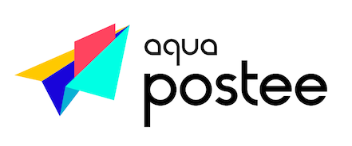

# Notice: Postee is no longer under active development or maintenance.

  

![Docker Pulls][docker-pull]
[![Go Report Card][report-card-img]][report-card]

[![License][license-img]][license]

[download]: https://img.shields.io/github/downloads/aquasecurity/postee/total?logo=github
[release-img]: https://img.shields.io/github/release/aquasecurity/postee.png?logo=github
[release]: https://github.com/aquasecurity/postee/releases
[docker-pull]: https://img.shields.io/docker/pulls/aquasec/postee?logo=docker&label=docker%20pulls%20%2F%20postee
[go-doc-img]: https://godoc.org/github.com/aquasecurity/postee?status.svg
[report-card-img]: https://goreportcard.com/badge/github.com/aquasecurity/postee
[report-card]: https://goreportcard.com/report/github.com/aquasecurity/postee
[license-img]: https://img.shields.io/badge/License-mit-blue.svg
[license]: https://github.com/aquasecurity/postee/blob/master/LICENSE

Postee is a simple message routing application that receives input messages through a webhook interface, and can take enforce actions using predefined outputs via integrations.

Watch a quick demo of how you can use Postee:

Primary use of Postee is to act as a message relay and notification service that integrates with a variety of third-party services. Postee can also be used for sending vulnerability scan results or audit alerts from Aqua Platform to collaboration systems.

In addition, Postee can also be used to enforce pre-defined behaviours that can orchestrate actions based on input messages as triggers.

## Status
Although we are trying to keep new releases backward compatible with previous versions, this project is still incubating,
and some APIs and code structures may change.

## Documentation
The official [Documentation] provides detailed installation, configuration, troubleshooting, and quick start guides.

---
Postee is an [Aqua Security](https://aquasec.com) open source project.  
Learn about our [Open Source Work and Portfolio].  
Join the community, and talk to us about any matter in [GitHub Discussions] or [Slack].

[Documentation]: https://aquasecurity.github.io/postee/latest
[Open Source Work and Portfolio]: https://www.aquasec.com/products/open-source-projects/
[Slack]: https://slack.aquasec.com/
[GitHub Discussions]: https://github.com/aquasecurity/postee/discussions

## Release

1. Bump version of [helm chart](https://github.com/aquasecurity/postee/blob/main/deploy/helm/postee/Chart.yaml).
1. (By repository admin) Create a new tag. Postee and helm charts are automatically released by github actions.
1. (By repository admin) Run [publish-docs workflow](https://github.com/aquasecurity/postee/blob/main/.github/workflows/publish-docs.yml), if document has been updated.
