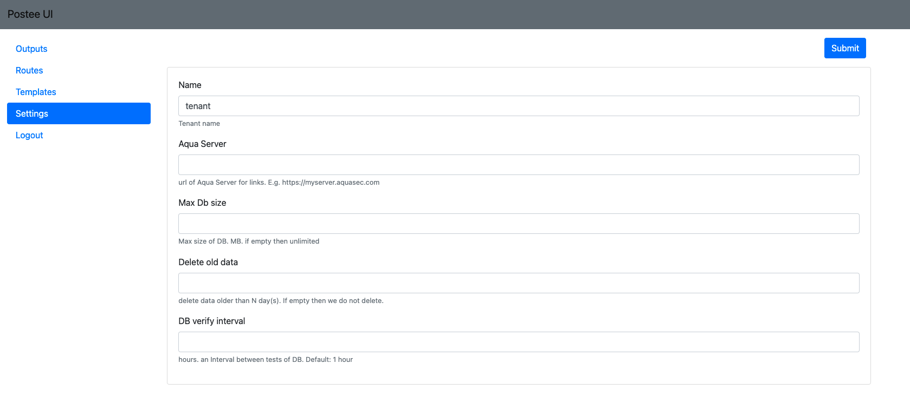
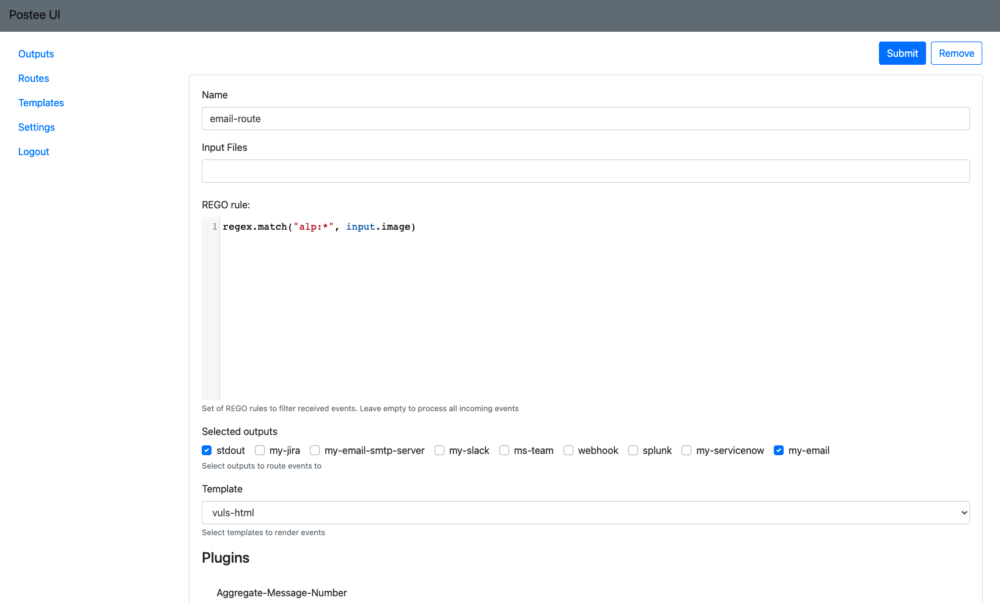
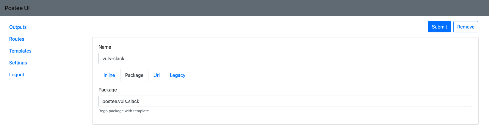

# Postee


![Docker Pulls][docker-pull]
[![Coverage Status][cov-img]][cov]
[![Go Report Card][report-card-img]][report-card]

[![License][license-img]][license]

[download]: https://img.shields.io/github/downloads/aquasecurity/postee/total?logo=github
[release-img]: https://img.shields.io/github/release/aquasecurity/postee.svg?logo=github
[release]: https://github.com/aquasecurity/postee/releases
[docker-pull]: https://img.shields.io/docker/pulls/aquasec/postee?logo=docker&label=docker%20pulls%20%2F%20postee
[go-doc-img]: https://godoc.org/github.com/aquasecurity/postee?status.svg
[cov-img]: https://codecov.io/github/aquasecurity/postee/branch/main/graph/badge.svg
[cov]: https://codecov.io/github/aquasecurity/postee
[report-card-img]: https://goreportcard.com/badge/github.com/aquasecurity/postee
[report-card]: https://goreportcard.com/report/github.com/aquasecurity/postee
[license-img]: https://img.shields.io/badge/License-mit-blue.svg
[license]: https://github.com/aquasecurity/postee/blob/master/LICENSE

# Table of Contents
- [Abstract](#abstract)
- [Installation](#installation)
  - [Docker](#docker)
  - [Kubernetes](#kubernetes)
  - [Helm](#helm)
  - [From Source](#from-source)
- [Postee Configuration File](#postee-configuration-file)
  - [Settings](#settings)
  - [Routes](#routes)
    - [Route Plugins](#route-plugins)
  - [Templates](#templates)
  - [Outputs](#outputs)
    - [ServiceNow](#serviceNow)
    - [Jira](#jira)
    - [Email](#email)
    - [Slack](#slack)
    - [MsTeams](#ms-teams)
    - [Splunk](#splunk)
    - [Generic Webhook](#generic-webhook)
- [Configure the Aqua Server with Webhook Integration](#configure-the-aqua-server-with-webhook-integration)
- [Customizing Templates](#customizing-templates)
- [Postee UI](#postee-ui)
- [Misc](#misc)


## Abstract
Postee is a simple message routing application that receives JSON input messages through a webhook interface, and delivers them based on rules to a set of collaboration systems, including: JIRA, Email, Slack, Microsoft Teams, ServiceNow, Splunk and Generic WebHook.

Primary use of Postee is to act as a notification component for Aqua Security products. It's extremely useful for sending vulnerability scan results or audit alerts from Aqua Platform to collaboration systems.


## Installation

To run Postee you will first need to configure the [Postee Configuration File](#postee-configuration-file), which contains all the message routing logic. 
After the configuration file is ready, you can run the official Postee container image: **aquasec/postee:latest**, or compile it from source. 

There are different options to mount your customize configuration file to Postee - if running as a Docker container, then you simply mount the configuration files as a volume mount. If running as a Kubernetes deployment, you will need to mount it as a ConfigMap. See the below usage examples for how to run Postee on different scenarios.

After Postee will run, it will expose two endpoints, HTTP and HTTPS. You can send your JSON messages to these endpoints, where they will be delivered to their target system based on the defined rules.

### Docker
To run Postee as a Docker container, you mount the cfg.yaml to '/config/cfg.yaml' path in the Postee container.


```bash
docker run -d --name=postee -v /<path to configuration file>/cfg.yaml:/config/cfg.yaml \
    -e POSTEE_CFG=/config/cfg.yaml -e POSTEE_HTTP=0.0.0.0:8084 -e POSTEE_HTTPS=0.0.0.0:8444 \ 
    -p 8084:8084 -p 8444:8444 aquasec/postee:latest
```

### Kubernetes
When running Postee on Kubernetes, the configuration file is passed as a ConfigMap that is mounted to the Postee pod. 

See [Kubernetes instructions](./deploy/kubernetes/README.md) to run Postee on Kubernetes using deployment yamls.

### Helm
When running Postee on Kubernetes, the configuration file is passed as a ConfigMap that is mounted to the Postee pod. 

See [Helm instructions](./deploy/helm/README.md) to run Postee on Kubernetes using Helm chart.

### From Source
Clone and build the project: 
```bash
git clone git@github.com:aquasecurity/postee.git
make build
```
After that, modify the cfg.yaml file and set the 'POSTEE_CFG' environment variable to point to it.
```bash
export POSTEE_CFG=<path to cfg.yaml>
./bin/postee
```

## Postee Configuration File

When Postee receives a message it will process it based on routing rules and send it to the appropriate target. How does it know how to do that? Well, this information is defined in Postee's configuration file, [cfg.yaml](https://github.com/aquasecurity/postee/blob/main/cfg.yaml), which contains the following definitions:

1. General settings
2. Routes
3. Templates
4. Outputs

> NOTE See examples of common Postee configuration files here: [Examples](docs/examples)

### Settings

General settings are specified at the root level of cfg.yaml. They include general configuration that applies to the Postee application.



<details>
<summary>Details</summary>

Key | Description | Possible Values | Example Value
--- | --- | --- | ---
*aqua-server*|Aqua Platform URL. This is used for some of the integrations to will include a link to the Aqua UI| Aqua Platform valid URL | https://server.my.aqua
*db-verify-interval*|Specify time interval (in hours) for Postee to perform database cleanup jobs. Default: 1 hour| any integer value  | 1
*max-db-size*|The maximum size of Postee database (in MB). Once reached to size limit, Postee will delete old cached messages. If empty then Postee database will have unlimited size| any integer value | 200
</details>

### Routes
A route is used to control message flows. Each route includes the input message condition, the template that should be used to format the message, and the output(s) that the message should be delivered to.

The most important part of a route is the **input definition using the Rego language** to define what are the conditions for an incoming message to be handled by a certain route.



> NOTE `See the complete Rego Language in` [OPA-reference](https://www.openpolicyagent.org/docs/latest/policy-reference/#built-in-functions)

After defining the route's input condition, what is left is to define the template that will be used to format the input message, and the output that formatted message will be sent to.

The below table describes the fields to define a route:

<details>
<summary>Details</summary>

Key | Description | Possible Values | Example
--- | --- | --- | ---
*name*|Unique name of route| string | teams-vul-route
*input*|A Rego rule to match against incoming messages. If there is a match then this route will be chosen for the incoming message| Rego language statements | contains(input.message,"alpine")
*input-files*|One or more files with Rego rules| Set of Rego language files | ["Policy-Registry.rego", "Policy-Min-Vulnerability.rego"] 
*outputs*|One or more outputs that are defined in the "outputs" section| Set of output names. At least one element is required | ["my-slack", "my-email"].
*template*| A template that is defined in the "template" section| any template name | raw-html
</details>

The `rego-filters` folder contains examples of policy related functions. You can use the examples. To do this, you need to change the input data in the arrays of rego files and fill in the config file. If you want to use an other folder, set the 'REGO_FILTERS_PATH' environment variable to point to it. When using 2 or more files, they will be combined by "OR".
To combine policy related functions by "AND", use the `Policy-Related-Features.rego` file, change the input data, and fill in the required function in allow.
```
allow{
    PermitImageNames
    PermitMinVulnerability
}
```
If you are using your own rego files, then the **package** field should be "postee" and the result should be in the  **allow** function:
```
package postee

your_function{...} # 0 or more your functions

allow {
    your_function
}
```
For example, the following input definition will match JSON messages that have 'image.name' field with value that contains the string 'alpine':

```
input: contains(input.image,"alpine")
```

Another example using regular expression:
```
input: regex.match("alp:*", input.image)
```

You can create more complex input definitions using the Rego language. For example, the following input definition will match JSON messages that have 'image.name' field with value 'alpine' and that their registry is 'Docker Hub' and they have a critical vulnerability. 

```
input: |
  contains(input.image,"alpine")
  contains(input.registry, "Docker Hub")
  input.vulnerability_summary.critical>0
```

> NOTE See more route samples configuration [HERE](./docs/routes.md)
#### Route plugins

'Plugins' section contains configuration for useful Postee features.

<details>
<summary>Details</summary>

Key | Description | Possible Values | Example
--- | --- | --- | ---
*aggregate-message-number*|Number of messages to aggregate into one message.| any integer value | 10
*aggregate-message-timeout*|number of seconds, minutes, hours to aggregate|Maximum is 24 hours Xs or Xm or Xh | 1h
*unique-message-props*|Optional. Comma separated list of properties which uniquely identifies an event message. If message with same property values is received more than once, consequitive messages will be ignored. | Array of properties that their value uniquely identifies a message | To avoid duplicate scanning messages you can use the following properties: ```unique-message-props: ["digest","image","registry", "vulnerability_summary.high", "vulnerability_summary.medium", "vulnerability_summary.low"]```
*unique-message-timeout*|Optional. Used along with *unique-message-props*, has no effect if unique props are not specified. Number of seconds/minutes/hours/days before expiring of a message. Expired messages are removed from db. If option is empty message is never deleted | 1d
</details>

### Templates
Templates are used to format input messages before sending them to the output. For example - before sending a message to Microsoft Teams there is a need to format the input JSON into an HTML. This is done using a template.

Each template has a 'name' field, which is used by the route to assign the template to input and output.



In addition to name, a template will have **one** of the 4 below keys:

<details>
<summary>Details</summary>

Key | Description | Example
--- | --- | ---
*rego-package*|Postee loads bundle of templates from `rego-templates` folder. This folder includes several templates shipped with Postee, which can be used out of the box. You can add additional custom templates by placing Rego file under the 'rego-templates' directory.| `postee.vuls.html`
*body*| Specify inline template. Relative small templates can be added to config directly | input
*url*| Load from url. Rego template can be loaded from url.| http://myserver.com/rego.txt
*legacy-scan-renderer*| Legacy templates are introduced to support Postee V1 renderers. Available values are  "jira", "slack", "html". "jira" should be used for jira integration, "slack" is for slack and "html" is for everything else. | html
</details>

> More details about Templates implementation [here](https://github.com/aquasecurity/postee/tree/main/rego-templates)

### Outputs
Outputs are remote services that messages should be sent to. Each output has two mandatory fields, which are 'name' and 'type'.


<details>
<summary>Details</summary>

Key | Description | Possible Values | Example
--- | --- | --- | ---
*name* | Unique name of the output. This name is used in the route definition. | Any string | teams-output
*type* | The type of the output | You can choose from the following types: email, jira, slack, teams, webhook, splunk, serviceNow | email
</details>

Depending on the 'type', additional parameters are required.

### ServiceNow

<details>
<summary>Details</summary>

Key | Description | Possible Values
--- | --- | ---
*user* | ServiceNow user name | 
*password* | User API key / password |
*instance* | Name of ServiceNow Instance (usually the XXX at XXX.servicenow.com)|
*board* | ServiceNow board name to open tickets on. Default is "incident" |
</details>

### Jira

Follow these steps to set up JIRA integration:
1. Get a new token for user:
    * Login to Jira Cloud.
Go to the user profile API tokens (JIRA Cloud users can find it here: https://id.atlassian.com/manage-profile/security/api-tokens).
Click on the Create API Token. A new API token for the user is created.
    * Login to Jira Server/Data center
Select your profile picture at top right of the screen, then choose  Settings > Personal Access Tokens. Select Create token. Give your new token a name. Optionally, for security reasons, you can set your token to automatically expire after a set number of days. Click Create. A new PAT for the user is created. 
2. Fill jira output in cfg.yaml:
    * Jira Cloud:
        * User: your email.
        * Password: your API token.
    * Jira Server/Data center:
        * User: your UserName.
        * Password: your Password.\
        or
        * Token: your Personal Access Tokens.

<details>
<summary>Details</summary>

Key | Description | Possible Values
--- | --- | ---
*url* | Jira project url |
*project-key* | The JIRA project key |
*user* | Jira user. Use email for Jira Cloud and UserName for Jira Server/Data Center | 
*password* | Optional: User's password. API token can also be used for Cloud Jira instances. | 
*token* | Optional: User's Personal Access Token. Used only for Jira Server/Data Center | 
*board* |  Optional: JIRA board key |
*priority*|  Optional: ticket priority, e.g., High |
*assignee*| Optional: comma separated list of users (emails) that will be assigned to ticket, e.g., ["john@yahoo.com"]. To assign a ticket to the Application Owner email address (as defined in Aqua Application Scope, owner email field), specify ["<%application_scope_owner%>"] as the assignee value |
*issuetype*| Optional: issue type, e.g., Bug |
*labels*| Optional: comma separated list of labels that will be assigned to ticket, e.g., ["label1", "label2"]|
*sprint*| Optional: Sprint name, e.g., "3.5 Sprint 8" |
</details>

For Jira you can also specify custom fields that will be populated with values.
Use the `unknowns` parameter in cfg.yaml for custom fields.
Under the `unknowns` parameter, specify the list of fields names to provide value for.
You can add "-numeric-field", "-multiple-value", "multiple-line-text-field", "-date-time-picker" and "-field-url" as suffix to the custom field name, to specify what is the field type.

For example: 
```yaml
unknowns:
     mycustom: "this is a text custom field"
     mycustom-numeric-field: 123
     mycustom-multiple-value: 1,2,3 
     mycustom-multiple-line-text-field: "text \n moretext" 
     mycustom-date-time-picker: 2014-04-11T12:14:26.880+0400
     mycustom-url: https://tour.golang.org/moretypes/7
```

### Email

<details>
<summary>Details</summary>

Key | Description | Possible Values
--- | --- | ---
*use-mx* | Whether to send the email as an SMTP server or a client. Specify 'true' if you would like to send email as an smtp server, in this case you don't need to provide user, password, host and port. | true, false
*user* | User name (usually email address) |
*password* | Password | 
*host* | SMTP host name | 
*port* | SMTP port |
*sender* |  Sender's email address |
*recipients*|  Recipients (array of comma separated emails), e.g. ["john@yahoo.com"]. To send the email to the Application Owner email address (as defined in Aqua Application Scope, owner email field), specify ["<%application_scope_owner%>"] as the recipients value |
</details>

### Slack

Getting the Slack webhooks [Create a Slack Custom App](https://api.slack.com/messaging/webhooks).

Copy webhook url to the Postee config

<details>
<summary>Details</summary>

Key | Description | Possible Values
--- | --- | ---
*url* | Slack WebHook URL (includes the access key) |
</details>

### MS Teams

Open your Microsoft Teams client. Click on the "..." near the channel you would like to send notifications to.

Choose "Connectors". The connectors window will open. Look for the "Incoming Webhook" connector (it is under the "All" category).

Click "Add" near the Incoming Webhook connector. Click "Add" again. Provide a name and click "Create".

You will be provided with a URL address. Copy this URL and put it in the cfg.yaml.

<details>
<summary>Details</summary>

Key | Description | Possible Values
--- | --- | ---
*url* | MS Teams WebHook URL |
</details>

### Splunk

You will need to care about an HTTP Event Collector in Splunk Enterprise or Splunk Cloud.

This can usually be found in the Splunk console under "Settings -> Data Inputs -> HTTP Event Collector -> Add New".

Once you create an HTTP Event Collector you will receive a token. You should provide this token, together with the Splunk HTTP Collector
URL, as part of the cfg.yaml settings.

<details>
<summary>Details</summary>

Key | Description | Possible Values
--- | --- | ---
*token* | The Splunk HTTP event collector token | 
*url* | URL to Splunk HTTP event collector (e.g. http://server:8088) |
*size-limit* | Optional. Maximum scan length, in bytes. Default: 10000 | 10000
</details>

### Generic Webhook

<details>
<summary>Details</summary>

Key | Description | Possible Values
--- | --- | ---
*url* | Webhook URL |
</details>

## Configure the Aqua Server with Webhook Integration
Postee can be integrated with Aqua Console to deliver vulnerability and audit messages to target systems.

You can configure the Aqua Server to send a Webhook notification whenever a new vulnerability is found.
Navigate to the **Image Scan Results Webhook** page, under the "Settings" menu.


Click "Enable sending image scan results to webhook", and specify the URL of Postee.
Now, scan an image and look at the Postee log files - you will see that Postee have received an incoming message once scan is done,
and that the message was routed based on the cfg.yaml configuration.

You can also configure the Aqua Server to send a Webhook notification for every audit message.
Navigate to the **Log Management** page, under the "Integrations" menu.


Click on the "Webhook" item, and specify the URL of Postee.

Now every audit event in Aqua will be sent to Postee. You can configure routes and input message conditions in Postee cfg.yaml to 
forward appropriate messages to target systems.

The **Postee URL** is in the following formats:

> `https://<Postee IP or DNS>:8445`
> `http://<Postee IP or DNS>:8082`

For more details about the Postee URL installed using kubernetes [click here](./deploy/kubernetes/README.md)
### Validate the Integration

To validate that the integration is working, you can scan a new image for security vulnerabilities from the Aqua Server UI (Images > Add Image > Specify Image Name > Add).

When vulnerabilities are found in an image, you will see that a JIRA ticket is created/ Email is received/ Slack message is posted to the channel.

To troubleshoot the integration, you can look at both the Aqua Postee container logs and the Aqua Server logs. Use the "docker logs <container name>" command to view these logs.*

## Customizing Templates
Postee loads bundle of templates from `rego-templates` folder. This folder includes several templates shipped with Postee, which can be used out of the box. You can add additional custom templates by placing Rego file under the 'rego-templates' directory.

To create your own template, you should create a new file under the 'rego-templates' directory, and use the
[Rego language](https://www.openpolicyagent.org/docs/latest/policy-language/) for the actual template code.

Message payload is referenced as `input` when template is rendered. The result variable should be used to store the output message, which is the result of the template formatting. 

The following variables should be defined in the custom Rego template.

<details>
<summary>Details</summary>

Key | Description |Type
--- | --- | ---
*result* | message body| Can be either string or json
*title* | message title| string
*aggregation_pkg*|reference to package used to aggregate messages (when aggregate-message-timeout or aggregate-message-number options are used). If it's missed then aggregation feature is not supported| valid rego package
</details>

So the simplest example of Rego template would look like:
```rego
package example.vuls.html

title:="Vulnerabilities are found"
result:=sprintf("Vulnerabilities are found while scanning of image: <i>%s</i>", [input.image])
```

Two examples are shipped with the app. One produces output for slack integration and another one builds html output which can be used across several integrations. These example can be used as starting point for message customization

## Postee UI
Postee provides a simple Web UI to simplify the configuration management. 

See [Postee UI](PosteeUI.md) for details how to setup the Postee UI.


## Misc

### Data Persistency
The Postee container uses BoltDB to store information about previously scanned images.
This is used to prevent resending messages that were already sent before.
The size of the database can grow over time. Every image that is saved in the database uses 20K of storage.  
 
Postee supports ‘PATH_TO_DB’ environment variable to change the database directory. To use, set the ‘PATH_TO_DB’ environment variable to point to the database file, for example: PATH_TO_DB="./database/webhook.db". By default, the directory for the database file is “/server/database/webhook.db”.

If you would like to persist the database file between restarts of the Postee container, then you should
use a persistent storage option to mount the "/server/database" directory of the container.
The "deploy/kubernetes" directory in this project contains an example deployment that includes a basic Host Persistency.
    
### Using environment variables in Postee Configuration File   
Postee supports use of environment variables for *Output* fields: **User**, **Password** and **Token**. Add preffix `$` to the environment variable name in the configuration file, for example:
```
outputs:
- name: my-jira   
  type: jira     
  enable: true
  user: $JIRA_USERNAME
  token: $JIRA_SERVER_TOKEN         
```

