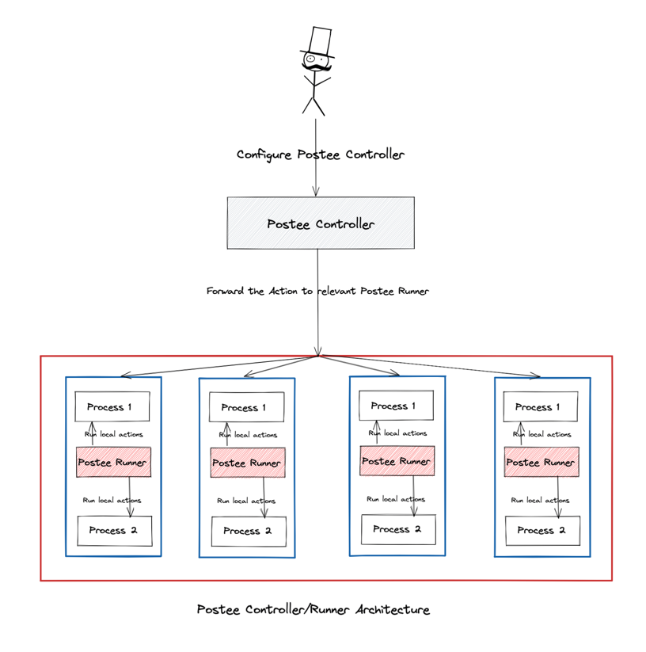

# Postee Orchestration Model

## Controller/Runner Architecture

Postee can be configured as Controller/Runner where the two work together to enforce Actions on their workloads. The Model can be represented as follows:



In the above diagram, the Postee Operator configures Postee Controller and the Postee Runners. Postee Controller/Runner model works for both On-Prem (Virtualized and non-Virtualized) and Kubernetes environments. The coloured boxes in the above diagram can be represented as follows:


## Controller/Runner Relationship

Postee Runners and their associated Postee Actions can be pre-defined in the Postee Configuration that is configured for each Postee Controller.

Postee Controllers are configured with each of the Postee Runners they are responsible for delegating the Postee Actions to. This configuration must be loaded by the Postee Operator.

The exchange between the Postee Runner and Controller can be visualized as below:


### Config
A sample Postee Controller/Runner model configuration could look as follows:

Please note that a few items have been omitted from this configuration YAML example for brevity.

```yaml
 version: v1
 type: controller
 name: Postee-Controller-Runnner

 # Routes are used to define how to handle an incoming message
 routes:
 - name: local-route
   input: contains(input.image, "alpine:3.10")
   outputs: [my-http-post-from-controller]
   template: raw-json

 - name: remote-route
   input: contains(input.SigMetadata.ID, "TRC-2")
   runs-on: "postee-runner-1"
   serialize-outputs: true
   outputs: [my-exec-from-runner, my-http-post-from-runner]
   template: raw-json

 - name: remote-route-2
   input: contains(input.SigMetadata.ID, "TRC-3")
   runs-on: "postee-runner-2"
   serialize-outputs: true
   outputs: [my-exec-from-runner]
   template: raw-json

 # Templates are used to format a message
 templates:
 - name: raw-json
   rego-package: postee.rawmessage.json

 # Outputs are target services that should consume the messages
 outputs:
 - name: my-http-post-from-controller
   type: http
   enable: true
   url: "https://sample.url"
   method: POST
   body-content: |
     This is an example of a inline body
     Input Image: event.input.image
     
 - name: my-exec-from-runner
   type: exec
   enable: true
   env: ["MY_ENV_VAR=foo_bar_baz", "MY_KEY=secret"]
   exec-script: |
     #!/bin/sh
     echo $POSTEE_EVENT

 - name: my-http-post-from-runner
   type: http
   enable: true
   url: "https://sample.url"
   method: POST
   body-content: |
     This is an another example of a inline body
     Event ID: event.input.SigMetadata.ID

```

As seen above, each runner is distinctly identified by it's name. In this example we have two Postee Runners, "postee-runner-1" and "postee-runner-2". 

In order for these runners to be configured, they need to be wired in with a directive of `runs-on`. This tells the controller that the route is meant to be executed by a remote runner, instead of the controller itself.

When the directive of `runs-on` is not specified, Postee Controller behaves like a normal Postee and executes the Action by itself. This is useful when the running environment is not of interest and actions are ephemeral. We expect most of today's Postee Actions to follow such a pattern.

In the case, when a `runs-on` directive is specified, the Controller delegates the actual run of the action to the associated Postee Runner. At the moment, each controller needs to be defined upfront within the configuration YAML and each has it's own distinct identity.


### Workflow

In the following example, we will discuss the event flow between Producers, Postee Controller and Postee Runner.


In this scenario, the Postee Operator has configured Postee Controller to be responsible for 2 Postee Runners, each of which, is further responsible for executing certain Postee Actions. In turn, the controller also has a self defined action that it will not delegate to any runner but execute itself (JIRA Action).

Event Producers produce events that are sent to the Postee Controller. In the Postee Controller, they are re-routed to the Postee Runners that are responsible for handling them and executing necessary Postee Actions. 

Upon receiving the Postee Action, the Postee Runners take the Postee Actions that they have been configured for. 

Important distinction to note here is that the Event Producers don't have any knowledge about Postee Runners. They are only responsible for sending all their events upstream to the Postee Controller.


### Postee Runners Environment

#### Decoupled Runners
In most cases for Postee Runners, the working environment is not of a concern as most of the Postee Actions they take are de-coupled from the environment they run in. 

For example, if Postee Runner is configured to run an HTTP action that sends a payload to an endpoint, it can be run from anywhere as long as there's a network path up to make a request.

#### Coupled Runners
In certain cases, it may be required that the Postee Runner runs on the same host/node/environment that the Event was generated from. For example, if the Postee Runner is configured to run an Exec Postee Action, that removes vulnerable images as they are discovered. In this case it would only make sense to run the Postee Action in the same environment where the Event was produced (vulnerable image found).


### Practical Scenario: Postee and Tracee

Tracee is an Open Source tool that can generate events for a service like Postee to act upon. 

In the case of Tracee, events are produced on the host machine/node that Tracee runs on. Such a case can be visualized as follows:


A malicious process running on the host causes Tracee to trigger its event detection and emit a finding event. This event is sent up to the Postee Controller that is configured to handle all events generated from Tracee(s). 

This event that is sent up also includes additional metadata about the Postee Runner that is running alongside Tracee on the same node/host. This metadata is crucial for Postee Controller to identify which node/host the event has originated from in order to dispatch it with the specified Postee Action.

Service Discovery between Postee Runner and Tracee on the same node/host is an area that needs to be fully fleshed out but in short, it can be achieved by either a ```ConfigMap``` if Kubernetes or just a regular Filesystem if otherwise.

A ladder diagram to explain the above sequence of events is as follows:


### An Alternative Approach
The above approach require the Producers like Tracee to be able to convey information about the Postee Runner that's running alongside them. While this is doable for certain projects via ConfigMaps in K8s, or otherwise, there certainly can be scenarios where it is not an option. 

In such cases an alternate approach to structure the above flow can be taken. This case can be visualized as follows:


As seen here, Producers like Tracee are not required to send any additional information to the Postee Runner. In this case Tracee treats Postee Runner as just a normal Postee instance (without the knowledge of it being a Runner).

Postee Runner gets itself bootstrapped via the Postee Controller upon startup. The Controller pushes down any configuration options that maybe required for the Runner to work, as defined in the configuration yaml.

Upon receiving this event from Tracee, the Postee Runner executes the Postee Action as it has already been configured to do so.