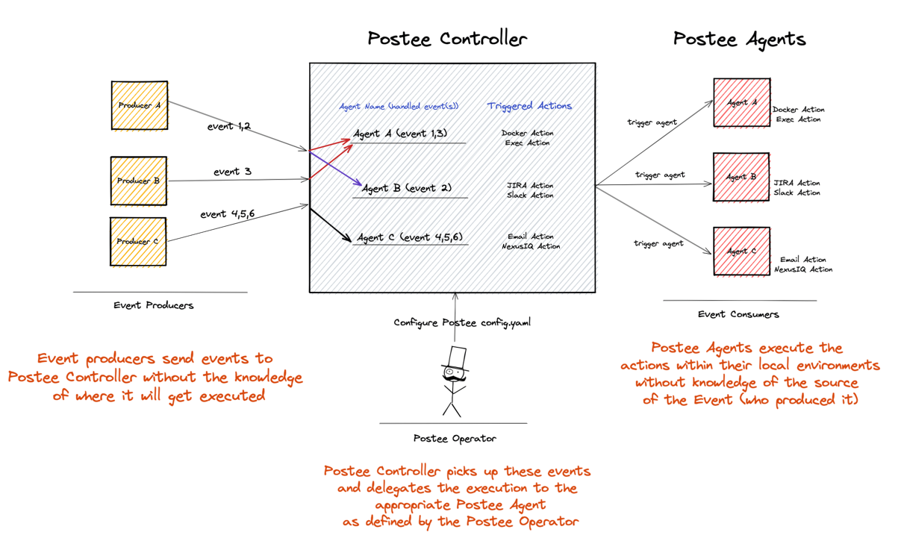
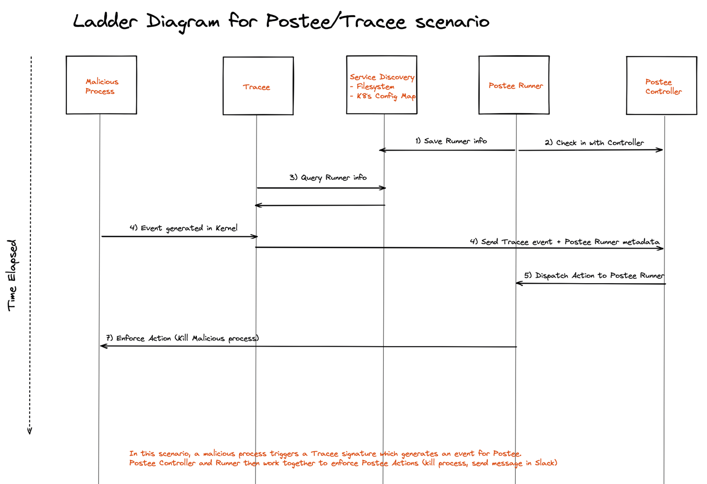

# Postee Orchestration Model

## Controller/Agent Architecture

Postee can be configured as Controller/Agent where the two work together to enforce Actions on their workloads. The Model can be represented as follows:


In the above diagram, the Postee Operator configures Postee Controller and the Postee Agents. Postee Controller/Agent model works for both On-Prem (Virtualized and non-Virtualized) and Kubernetes environments. The coloured boxes in the above diagram can be represented as follows:


## Controller/Agent Relationship

Postee Agents and their associated Postee Actions can be pre-defined in the Postee Configuration that is configured for each Postee Controller.

Postee Controllers are configured with each of the Postee Agents they are responsible for delegating the Postee Actions to. This configuration must be loaded by the Postee Operator.

// TODO: Add an example config for Postee Controller that configures Postee Agents and the Postee Actions associated with them.


### Workflow

In the following example, we will discuss the event flow between Producers, Postee Controller and Postee Agent.



In this scenario, the Postee Operator has configured Postee Controller to be responsible for 3 Postee Agents, each of which, is further responsible for executing certain Postee Actions.

Event Producers produce events that are sent to the Postee Controller. In the Postee Controller, they are re-routed to the Postee Agents that are responsible for handling them and executing necessary Postee Actions. 

Upon receiving the Postee Action, the Postee Agents take the Postee Actions that they have been configured for. 

Important distinction to note here is that the Event Producers don't have any knowledge about Postee Agents. They are only responsible for sending all their events upstream to the Postee Controller.


### Postee Agents Environment

#### Decoupled Agents
In most cases for Postee Agents, the working environment is not of a concern as most of the Postee Actions they take are de-coupled from the environment they run in. 

For example, if Postee Agent is configured to run an HTTP action that sends a payload to an endpoint, it can be run from anywhere as long as there's a network path up to make a request.

#### Coupled Agents
In certain cases, it may be required that the Postee Agent runs on the same host/node/environment that the Event was generated from. For example, if the Postee Agent is configured to run an Exec Postee Action, that removes vulnerable images as they are discovered. In this case it would only make sense to run the Postee Action in the same environment where the Event was produced (vulnerable image found).


### Practical Scneario: Postee and Tracee

Tracee is an Open Source tool that can generate events for a service like Postee to act upon. 

In the case of Tracee, events are produced on the host machine/node that Tracee runs on. Such a case can be visualized as follows:


A malicious process running on the host causes Tracee to trigger its event detection and emit a finding event. This event is sent up to the Postee Controller that is configured to handle all events generated from Tracee(s). 

This event that is sent up also includes additional metadata about the Postee Agent that is running alongside Tracee on the same node/host. This metadata is crucial for Postee Controller to identify which node/host the event has originated from in order to dispatch it with the specified Postee Action.

Service Discovery between Postee Agent and Tracee on the same node/host is an area that needs to be fully fleshed out but in short, it can be achieved by either a ```ConfigMap``` if Kubernetes or just a regular Filesystem if otherwise.

A ladder diagram to explain the above sequence of events is as follows:


### Pros/Cons of Controller/Agent approach

