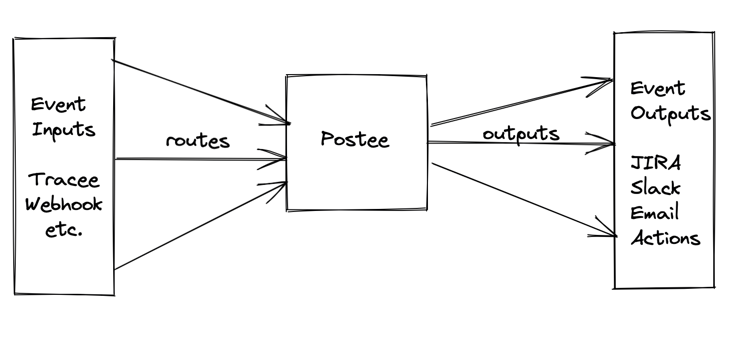

# Postee Roadmap

## Open Questions

### What problem does Postee solve today?
1. Message broker: Today Postee is the bridge between inputs (Tracee, etc.) and outputs (JIRA, Slack, etc.)
2. Automate alert enablement: With Postee Actions, a user can "act" upon alerts/events as they are received.

### What problems *can* Postee solve tomorrow?
1. Alert Dashboard
   1. A centralized view of all events received and another view which shows which alerts were acted upon.
   
   2. The dashboard can also be used to configure new integrations.
   

### Architecture
1. Does a Postee instance run per node (distributed) or per cluster (monolith)?

### Distributed Model

#### Pros/Cons of Distributed model

| Pros                                                 | Cons                                |
|------------------------------------------------------|-------------------------------------|
| Less management overhead within each Postee instance | Changes current model               |
| Ability to run localized Actions                     | Configuration distribution overhead |
| Configuration re-usability (copy/pasta)              |                                     |
| Lower surface area for attack per instance           |                                     |

### Monolith Model

#### Pros/Cons of Monolith model

| Pros                                              | Cons                                                           |
|---------------------------------------------------|----------------------------------------------------------------|
| Follows existing model of 1 Postee per deployment | Single point of failure                                        |
| Ease of configuration, single YAML                | Outputs like Actions only possible with remote execution       |
|                                                   | Complex as Postee needs to keep global state                   |
|                                                   | Configurations are specific to deployment and cannot be reused |

### Postee Actions
1. Today actions assume that Postee runs and is able to act in the same environment. If Postee runs as a monolith, how do we make actions work? E.g. Postee Exec Action can run a shell script in the same environment as the Postee instance. If a user receives an event from a remote source, the user may expect that actions are taken by the Postee Exec Action on the source node, *NOT* on the node where Postee runs.
2. If we want to keep Postee as a monolith, do we add the ability for each Postee Action to be executed remotely? What security implications would this have?
3. If we move to a distributed model of Postee, Actions would fit in well.

### Configuration via YAML/Rego
1. Today Postee config lives in YAML files. Postee can evaluate rules that are written in Rego. 
2. If Postee UI is used, the configuration can be initially loaded via the config yaml but later on as the UI is configured (new outputs are enabled, disabled) the config can live in memory and also be saved to disk.
