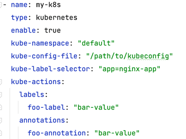

## Motivation
Proper alert management can help security practitioners make informed decisions about their codebase. However, security alerts can cause fatigue if acting on them isn’t possible. Postee, an open source security alert management tool, helps mitigate some of those concerns. It enables teams to define routes and rules by which alerts are handled and redirected to

## User Stories
In a typical Postee setup, users can configure the tool to receive events from a variety of sources over a webhook. This allows for ease of use in existing environments. Furthermore, users can configure Postee to process these incoming events and, based on logic defined via Rego rules, send them to different actions.

As a **Postee User**

- _I want_, to be able to remove a vulnerable image from my cluster upon a Trivy scan  
  _So that_, I can keep such images unavailable for deployment.


- _I want_, to ship Tracee security notification logs from my node when events are detected   
  _So that_, I can build a timelog for forensics purposes.


- _I want_, to be able to add labels to my deployments when Starboard detects a vulnerable image in my cluster   
  _So that_, I can effectively tag my resources.


Actions are remote services that messages should be sent to. Each action has two mandatory fields, which are 'name' and 'type'.

Key | Description | Values | Example
--- | --- | --- | ---
*name* | Unique name of the action. This name is used in the route definition. | Any string | teams-action
*type* | The type of the action | You can choose from the following types: email, jira, slack, teams, webhook, splunk, serviceNow | email

!!! tip 
      Depending on the 'type', additional parameters are required.

## Jira

Follow these steps to set up JIRA integration:

1. Get a new token for user:
    * Login to Jira Cloud.
      Go to the user profile API tokens (JIRA Cloud users can find it [here](https://id.atlassian.com/manage-profile/security/api-tokens)).
    * Click on the Create API Token. A new API token for the user is created.
    * Login to Jira Server/Data center
      Select your profile picture at top right of the screen, then choose  Settings > Personal Access Tokens. Select Create token. Give your new token a name. Optionally, for security reasons, you can set your token to automatically expire after a set number of days. Click Create. A new PAT for the user is created.
2. Fill jira action in cfg.yaml:
    * Jira Cloud:
        * User: your email.
        * Password: your API token.
    * Jira Server/Data center:
        * User: your UserName.
        * Password: your Password.\
          or
        * Token: your Personal Access Tokens.

Key           | Description          | Values | Required 
--------------|----------------------|-----------------|----------
*url*         | Jira project url     |                 | Yes
*project-key* | The JIRA project key |                 | Yes
*user*        | Jira user. Use email for Jira Cloud and UserName for Jira Server/Data Center    |             | Yes
*password*    | User's password. API token can also be used for Cloud Jira instances. |             | No
*token*       | User's Personal Access Token. Used only for Jira Server/Data Center   |             | No          
*board*       | JIRA board key              |           | No
*priority*    | ticket priority, e.g., High |           | No
*assignee*    | comma separated list of users (emails) that will be assigned to ticket, e.g., ["john@yahoo.com"]. To assign a ticket to the Application Owner email address (as defined in Aqua Application Scope, owner email field), specify ["<%application_scope_owner%>"] as the assignee value   |               | No
*issuetype*   | issue type, e.g., Bug        |           | No
*labels*      | comma separated list of labels that will be assigned to ticket, e.g., ["label1", "label2"]|         | No
*sprint*      | Sprint name, e.g., "3.5 Sprint 8" |      | No

For Jira you can also specify custom fields that will be populated with values.
Use the `unknowns` parameter in cfg.yaml for custom fields.
Under the `unknowns` parameter, specify the list of fields **names** to provide value for. Field name can contains spaces.

Possible options for getting the field name:

??? note "Get field name from Jira UI"
    1. Move to your jira.
    2. Navigate to **Settings**() > **Issues** > **Custom fields** under the Fields section: 
    3. Click on the required field. 
    4. Get value from **Name** field.


??? note "Get field name from Jira REST API"
    1. Get all Jira fields [according to instructions](https://developer.atlassian.com/cloud/jira/platform/rest/v3/api-group-issue-fields/#api-rest-api-3-field-get)
    2. Find needed field:
     
    ```
     ...
         "id": "customfield_10014",
         "key": "customfield_10014",
         "name": "Epic Link",
         "untranslatedName": "Epic Link",
         "custom": true,
         "orderable": true,
         "navigable": true,
         "searchable": true,
         "clauseNames": [
           "cf[10014]",
           "Epic Link"
         ],
         "schema": {
           "type": "any",
           "custom": "com.pyxis.greenhopper.jira:gh-epic-link",
           "customId": 10014
         }
       },
     ...
    ```
    3. Get value from **Name** field.

    Example of using the `unknowns` parameter in the cfg.yaml file:

    ```yaml
    unknowns:
         Epic Link: "K8S-1"
    ```

!!! tip
      You can add "-numeric-field", "-multiple-value", "multiple-line-text-field", "-date-time-picker" and "-field-url" as suffix to the custom field name, to specify what is the field type.

      For example:
      ```yaml
      unknowns:
           mycustom: "this is a text custom field"
           mycustom-numeric-field: 123
           mycustom-multiple-value: 1,2,3
           mycustom-multiple-line-text-field: "text \n moretext"
           mycustom-date-time-picker: 2014-04-11T12:14:26.880+0400
           mycustom-url: https://tour.golang.org/moretypes/7
      ```

## Email
Key          | Description | Values | Required 
-------------|-------------|-----------------|----------
*use-mx*     | Whether to send the email as an SMTP server or a client. Specify 'true' if you would like to send email as an smtp server, in this case you don't need to provide user, password, host and port. | true, false |      
*user*       | if auth supported. User name (usually email address) |      | No
*password*   | if auth supported. Password |     | No
*host*       | SMTP host name |          | Yes
*port*       | SMTP port      |          | Yes
*sender*     |  Sender's email address   |           | Yes
*recipients* |  Recipients (array of comma separated emails), e.g. ["john@yahoo.com"]. To send the email to the Application Owner email address (as defined in Aqua Application Scope, owner email field), specify ["<%application_scope_owner%>"] as the recipients value |         | Yes

## Slack
Getting the Slack webhooks [Create a Slack Custom App](https://api.slack.com/messaging/webhooks).

Copy webhook url to the Postee config

Key | Description | Values
--- | --- | ---
*url* | Slack WebHook URL (includes the access key) |

## MS Teams

Open your Microsoft Teams client. Click on the "..." near the channel you would like to send notifications to.

Choose "Connectors". The connectors window will open. Look for the "Incoming Webhook" connector (it is under the "All" category).

Click "Add" near the Incoming Webhook connector. Click "Add" again. Provide a name and click "Create".

You will be provided with a URL address. Copy this URL and put it in the cfg.yaml.

Key | Description | Values
--- | --- | ---
*url* | MS Teams WebHook URL |

## Splunk

You will need to care about an HTTP Event Collector in Splunk Enterprise or Splunk Cloud.

!!! tip
      This can usually be found in the Splunk console under "Settings -> Data Inputs -> HTTP Event Collector -> Add New".

Once you create an HTTP Event Collector you will receive a token. You should provide this token, together with the Splunk HTTP Collector
URL, as part of the cfg.yaml settings.

Key          | Description                                                         | Values | Required  
------------ | ------------------------------------------------------------------  | --------------- | ---------             
*token*      | The Splunk HTTP event collector token                               |                 | Yes
*url*        | URL to Splunk HTTP event collector (e.g. http://server:8088)        |                 | Yes
*size-limit* | Maximum scan length, in bytes. Default: 10000 | 10000     |                 | No

## ServiceNow

Key        | Description                                                        | Values  | Required  
---------- | ------------------------------------------------------------------ | ---------------  | --------- 
*user*     | ServiceNow user name                                               |                  | Yes
*password* | User API key / password                                            |                  | Yes
*instance* | Name of ServiceNow Instance (usually the XXX at XXX.servicenow.com)|                  | Yes
*board*    | ServiceNow board name to open tickets on. Default is "incident"    |                  |           

## Nexus IQ

Key               | Description                                              | Values | Required  
----------------- | -------------------------------------------------------- | --------------- | --------  
*user*            | Nexus IQ user name                                       |                 | Yes
*password*        | Nexus IQ password                                        |                 | Yes
*url*             | Url of Nexus IQ server                                   |                 | Yes
*organization-id* | Organization UID like "222de33e8005408a844c12eab952c9b0" |                 | Yes

## Dependency Track

Key                        | Description                    | Values  | Required  
-------------------------- | ------------------------------ | ------- | --------  
*url*                      | Url of Dependency Track        |         | Yes
*dependency-track-api-key* | API key of Dependency Track    |         | Yes

## OpsGenie

??? note "Set up OpsGenie and get a token"

    1. Go to your Opsgenie and select Teams from menu.
    2. Select your team to access your team dashboard.
    3. Select Integrations from left navigation.
    4. Select Add Integration.
    5. Select API Integration.
    6. Copy `API Key`.
    7. When done with all configurations, select Save Integration to enable the integration.

    See more details here: [Set up an integrated tool for Opsgenie](https://support.atlassian.com/opsgenie/docs/set-up-an-integrated-tool/).

!!! caution
    Postee requires an API key from an [API integration](https://support.atlassian.com/opsgenie/docs/what-is-a-default-api-integration/). This can be added under the Settings -> Integrations tab. Or it can under a team's Integrations tab.

    If the integration assigns an alert to a team, it can only create alerts for that team.
      
    An API key from the `API Key Management` tab will produce an HTTP 403 error. This API Key is valid but cannot create alerts as it lacks necessary permissions. 

Key        | Description                             | Values | Required 
-----------| --------------------------------------- | ----------------|--------- 
token      | an API key from an API integration      |                 | Yes
user       | Display name of the request owner.      |                 | No
assignee   | Comma separated list of users that the alert will be routed to send notifications                     |          | No
recipients | Comma separated list of users that the alert will become visible to without sending any notification  |          | No
priority   | Specify the alert priority. Default is "P3" | "P1" "P2" "P3" "P4" "P5"| No
tags       | Comma separated list of the alert tags.     |                         | No
alias      | Client-defined identifier of the alert.     |                         | No
entity     | Entity field of the alert that is generally used to specify which domain alert is related to. |        | No

## Exec

 Option      | Usage                                                                                     | Required 
-------------|-------------------------------------------------------------------------------------------|----------
 env         | custom environment variables to be exposed in the shell of the executing script | No
 input-file  | custom shell script to executed                                                 | Yes
 exec-script | inline shell script executed                                                    | Yes

The Exec Action also internally exposes the `$POSTEE_EVENT` environment variable with the input event that triggered the action. This can be helpful in situations where the event itself contains useful information.

Below is an example of using `$POSTEE_EVENT`. It uses the inline exec-script script:


## HTTP


 Option   | Usage                                   | Required 
----------|-----------------------------------------|----------
 URL      | URL of the remote server      | Yes
 Method   | e.g., GET, POST               | Yes
 Headers  | custom headers to send        | No
 Timeout  | custom timeout for HTTP call  | No
 Bodyfile | input file for HTTP post body | No


## Kubernetes


 Option              | Usage                                                                                                                           | Required 
---------------------|---------------------------------------------------------------------------------------------------------------------------------|----------
 kube-namespace      | Kubernetes namespace to use.                                                                                          | Yes
 kube-config-file    | Path to .kubeconfig file                                                                                              | Yes
 kube-label-selector | if specifying labels or annotations.                                                                                  | Yes
 kube-actions        | key-value pair of labels and annotations<br/>Labels must be added via "labels" key and Annotations via "annotations". | No


## Docker


 Option               | Usage                                                                                                                                                         | Required 
----------------------|---------------------------------------------------------------------------------------------------------------------------------------------------------------|----------
 docker-image-name    | Image name of the docker image.                                                                                                                                | Yes
 docker-cmd           | Command to run inside the docker image.                                                                                                                        | Yes
 docker-env           | Environment variables to set in the container.                                                                                                                 | No
 docker-network       | Connect the action container to the specified network. {e.g. "host"}                                                                                           | No
 docker-volume-mounts | *Volume mounts present inside the container.<br/> * _If you have specified volume mounts, you also need to pass them through into the postee docker container_ | No

!!! note
      When running Postee in a Docker container, it is required to mount the Docker socket within the Postee container to be able to spin up Docker Action container instances. This can be done as follows:
      ```
      docker run --rm --name=postee --group-add $(stat -c '%g' /var/run/docker.sock) -v /var/run/docker.sock:/var/run/docker.sock -v /path/to/cfg.yaml:/config/cfg.yaml  -e POSTEE_CFG=/config/cfg.yaml -e POSTEE_HTTP=0.0.0.0:8084     -e POSTEE_HTTPS=0.0.0.0:8444     -p 8084:8084 -p 8444:8444 aquasecurity/postee:latest
      ```

!!! tip
      If you have specified volume mounts for a docker container and use Postee in a docker container as well, remember to mount them within the Postee container as well:
      ```
      docker run --rm --name=postee --group-add $(stat -c '%g' /var/run/docker.sock) -v /var/run/docker.sock:/var/run/docker.sock -v /path/to/cfg.yaml:/config/cfg.yaml  -v /my/custom/volume:/my/custom/volume -e POSTEE_CFG=/config/cfg.yaml -e POSTEE_HTTP=0.0.0.0:8084     -e POSTEE_HTTPS=0.0.0.0:8444     -p 8084:8084 -p 8444:8444 aquasecurity/postee:latest
      ```


## Generic Webhook

Key | Description | Values
--- | --- | ---
*url* | Webhook URL |
*timeout*  | Webhook timeout  |

!!! tip
The generic webhook action can be used for sending Postee output to any endpoint that can receive a request. You can find some interesting examples as part of the [Postee Blueprints](/blueprints)

## DefectDojo

DefectDojo is a DevOpsSec and vulnerability management tool. When sending a Trivy operator report, the API expects us to send a multipart/form-data POST request to the API endpoint. Authentication is done through an API token that can be easily provided by either environment variables or K8s secrets.

At the time of writing, Postee doesn't provide any native action module targeting the DefectDojo API. Instead the solution is to apply a shell script through an EXEC action that consumes the JSON output of a custom made REGO template that mangles the JSON payload received from a Trivy operator instance.

The REGO template will be use-case specific because the metadata added heavily depends on the users setup and hierarchical structure inside the user's DefectDojo instance.

The resulting JSON data puts the Trivy report under the `report` key and derived meta data under the `metadata` key. The idea behind this is to provide a data structure that will make it easy to develop a more generic shell script. In a subsequent step an EXEC module is called consuming the resulting JSON structure from an environment variable called `POSTEE_EVENT`. For more information see the [EXEC action](#Exec).

### Implementation

1. DefectDojo - create an non-interactive API user and an API token
2. Postee - deploy the token as `DEFECTDOJO_API_TOKEN` environment variable
3. Postee - deploy the base URL for DefectDojo using `DEFECTDOJO_URL`
4. Mount the [example shell script](../actions/example/exec/defectdojo-curl-upload-scan.sh) into the container
5. Mount the [example rego template](../rego-templates/example/defectdojo/trivy-operator-defectdojo.rego) into the container
6. Update your configuration according to the [example](../config/cfg-trivy-operator-defectdojo.yaml) provided
7. Validate the setup by sending an example report in JSON format using the following shell command `curl -X POST -H "Content-Type: application/json" -d @trivy-operator-report.json http://postee:8082`
