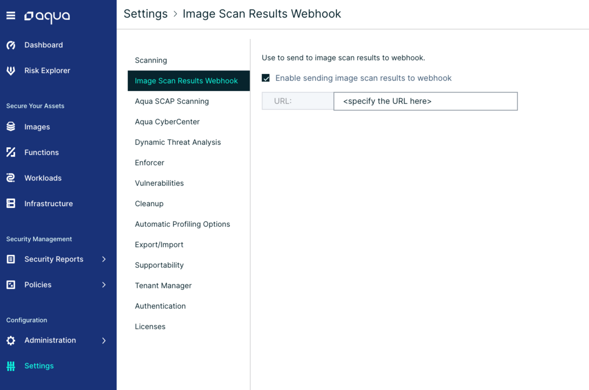
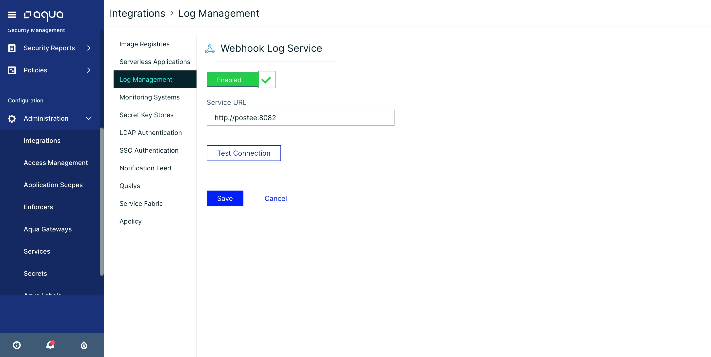

## Configure the Aqua Server with Webhook Integration
Postee can be integrated with Aqua Console to deliver vulnerability and audit messages to target systems.

You can configure the Aqua Server to send a Webhook notification whenever a new vulnerability is found.
Navigate to the **Image Scan Results Webhook** page, under the "Settings" menu.

Click "Enable sending image scan results to webhook", and specify the URL of Postee.
Now, scan an image and look at the Postee log files - you will see that Postee have received an incoming message once scan is done,
and that the message was routed based on the cfg.yaml configuration.

You can also configure the Aqua Server to send a Webhook notification for every audit message.
Navigate to the **Log Management** page, under the "Integrations" menu.

Click on the "Webhook" item, and specify the URL of Postee.

Now every audit event in Aqua will be sent to Postee. You can configure routes and input message conditions in Postee cfg.yaml to
forward appropriate messages to target systems.

The **Postee URL** is in the following formats:

> `https://<Postee IP or DNS>:8445`
> `http://<Postee IP or DNS>:8082`

!!! tip
        For more details about the Postee URL installed using kubernetes [click here](./deploy/kubernetes/README.md)

### Validate the Integration

To validate that the integration is working, you can scan a new image for security vulnerabilities from the Aqua Server UI (Images > Add Image > Specify Image Name > Add).

When vulnerabilities are found in an image, you will see that a JIRA ticket is created/ Email is received/ Slack message is posted to the channel.

!!! tip
        To troubleshoot the integration, you can look at both the Aqua Postee container logs and the Aqua Server logs. Use the "docker logs <container name>" command to view these logs.*

