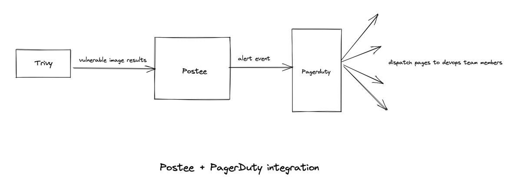

# Paging DevOps Teams

## Introduction
In this walkthrough, we will setup vulnerability scanning with [Trivy](https://github.com/aquasecurity/trivy) and send the results to Postee for paging DevOps team members for critical vulnerabilities as they are introduced.

## Scenario
A DevOps team would like to configure alerts for scheduled vulnerability scans to notify them about any vulnerable images that they might be running in their clusters. For this they decide to install Trivy, run it on a schedule and send the results to Postee.

They decide to configure Postee so that upon receiving such alerts, Postee sends an event to PagerDuty which fires off an alert to inform DevOps teams to take necessary action. 



## Sample Configs
In this case a sample configuration for the components can be described as follows:

### Postee Config
```yaml
routes:
- name: Trivy Alerts to Pagerduty
  input: input.report.summary.criticalCount > 0
  actions: [alert-devops]
  template: trivy-raw-json

# Templates are used to format a message
templates:
- name: trivy-raw-json
  rego-package: postee.rawmessage.json

# Actions are target services that should consume the messages
actions:
- name: alert-devops
  type: pagerduty
  enable: true
  pagerduty-auth-token: "<auth token>"
  pagerduty-routing-key: "<routing key>"
```