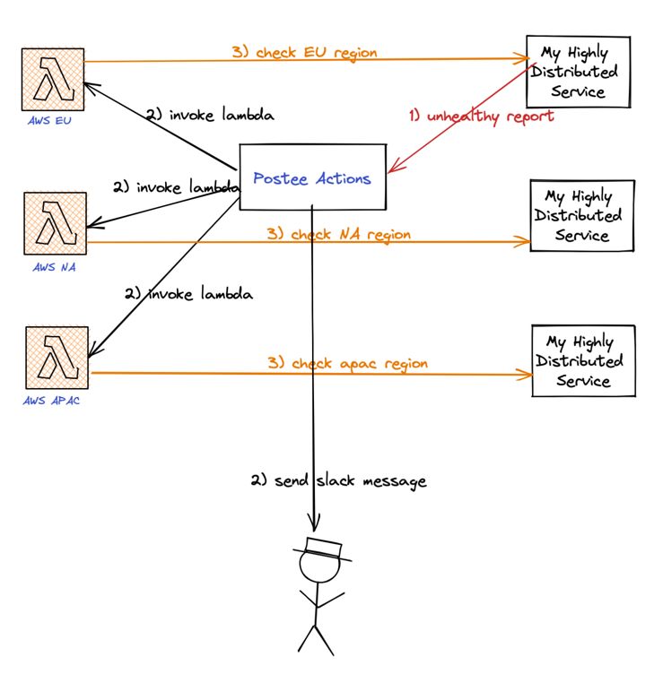

# Distributed Service Healthcheck

## Introduction
In this walkthrough, we will setup a globally distributed healthcheck for a service that we expect to be accessible from anywhere. This walkthrough will combine Postee Actions and AWS Lambda to accomplish this.

## Scenario
A DevOps operator gets paged about a service that they maintain. This page turns out to be flaky and non-actionable. 

In order to avoid operator fatigue, we can confirm the correctness of the page by triggering several healthchecks upon the notification of such an event. These healthchecks are performed externally via Lambda functions spread across different regions. 

By performing such globally distributed checks, the operator can be rest assured of the accuracy of any failures and in addition narrow out the scope of the problem.



## Sample Configs
In this case a sample configuration for the components can be described as follows:

### Postee Config

Postee Actions dispatches calls via the HTTP Action to 3 different AWS Lambda URLs. These requests are performed in parallel. In addition, the operator is performed of the trigger and notified via a Slack message.

```yaml
routes:
- name: actions-route
  input: contains(input.ServiceURL.Reachable, "false")
  actions: [send-slack-message, eu-check, apac-check, na-check]

# Outputs are target services that should consume the messages
actions:
- name: send-slack-messsage
  type: slack
  enable: true
  url: https://hooks.slack.com/services/TAAAA/BBB/<key>

- name: eu-check
  type: http
  enable: true
  url: "https://<uuid-func>.lambda-url.<aws-region>.on.aws/"
  method: POST

- name: apac-check
  type: http
  enable: true
  url: "https://<uuid-func>.lambda-url.<aws-region>.on.aws/"
  method: POST

- name: na-check
  type: http
  enable: true
  url: "https://<uuid-func>.lambda-url.<aws-region>.on.aws/"
  method: POST
```

### Lambda Config
```python
import os
from datetime import datetime
from urllib.request import Request, urlopen

SITE = "https://www.my-highly-available-website.com"
EXPECTED = "Text I expect to find"

def validate(res):
    return EXPECTED in res


def lambda_handler(event, context):
    timeNow = datetime.today().strftime('%Y-%m-%d-%H:%M:%S')
    print('Checking {} at {}...'.format(SITE, timeNow))
    try:
        req = Request(SITE, headers={'User-Agent': 'AWS Lambda'})
        if not validate(str(urlopen(req).read())):
            raise Exception('Validation failed')
    except:
        print('Check failed!')
        raise
    else:
        print('Check passed!')
        return ('aquasec.com is up! at {}'.format(timeNow))
    finally:
        print('Check complete at {}'.format(str(datetime.now())))
```

Inspired by: https://github.com/amazon-archives/serverless-app-examples/blob/master/python/lambda-canary/lambda_function.py 
