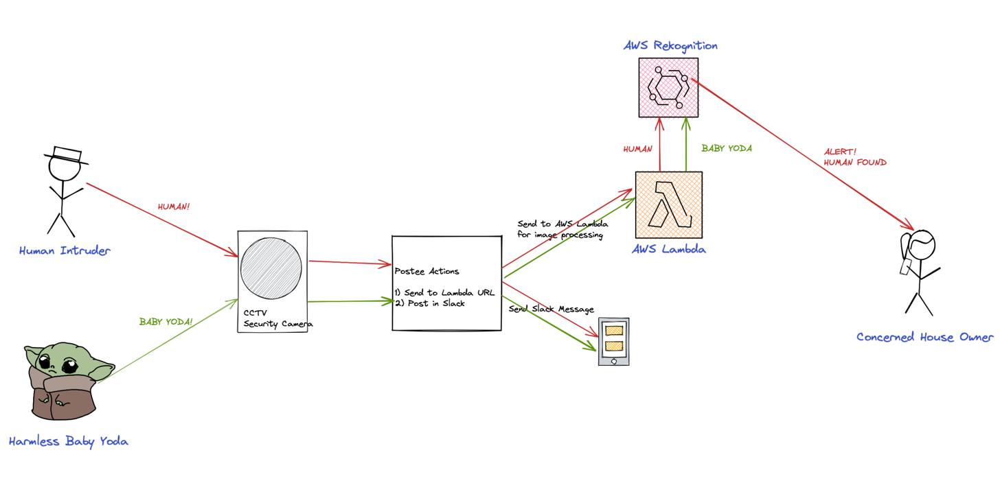

# Doing Serverless Image Recognition using Postee Actions and AWS

## Introduction
In this walkthrough, we will setup Postee Actions by re-using existing AWS Lambda Functions. This will allow anyone to configure and re-use existing AWS Lambda functionality as a Postee Action.

## Scenario
A user wants to be able to setup image processing of captured images in order to be able to identify any suspicious activity captured by the security (CCTV) camera.

Upon successful identification, the user should be informed of such an event.



## Sample Configs
In this case a sample configuration for the components can be described as follows:

### Postee Config
```yaml
routes:
- name: actions-route
  input: contains(input.Camera.Event, "Finding")
  serialize-actions: true
  actions: [send-slack-message, process-image]

# Outputs are target services that should consume the messages
actions:
- name: send-slack-messsage
  type: slack
  enable: true 
  url: https://hooks.slack.com/services/TAAAA/BBB/<key>

- name: process-image
  type: http
  enable: true
  url: "https://<uuid-func>.lambda-url.<aws-region>.on.aws/"
  method: POST
```

### AWS Rekognition & Lambda Config
The full source code is omitted here for brevity but this example was inspired by: https://docs.aws.amazon.com/code-samples/latest/catalog/python-rekognition-rekognition_video_detection.py.html

In order to setup the Lambda function we will need a handler that can process the incoming event from Postee. The below example demonstrates via Python psuedocode what this Lambda Handler could look like.
```python
import boto3
from rekognition_objects import (
    RekognitionFace, RekognitionVideo
)

def do_face_detection(self):
    return self._do_rekognition_job(
        "face detection",
        self.rekognition_client.start_face_detection,
        self.rekognition_client.get_face_detection,
        lambda response: [
            RekognitionFace(face['Face'], face['Timestamp']) for face in
            response['Faces']])

def lambda_handler(event, context):
    rekognition_client = boto3.client('rekognition')
    video = RekognitionVideo.from_event(event, rekognition_client)
    faces = video.do_face_detection()
    return faces
```