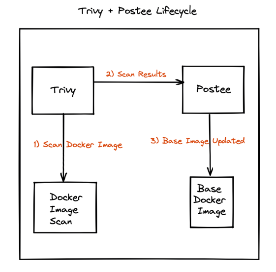

# Trivy Vulnerability Scan

## Introduction
In this walkthrough, we will setup vulnerability scanning with [Trivy](https://github.com/aquasecurity/trivy) and send the results to Postee for creation of JIRA tickets as an example.

A video format of this guide is also available [here](https://youtu.be/HZ5Z8jAVH8w?t=420).

## Scenario
A DevOps team would like to configure alerts for scheduled vulnerability scans to notify them about any vulnerable images that they might be running in their clusters. For this they decide to install Trivy, run it on a schedule and send the results to Postee.

They decide to configure Postee so that upon receiving such alerts, Postee creates a JIRA ticket for them to take a look at it at their disposal.



## Sample Configs
In this case a sample configuration for the components can be described as follows:

### Postee Config

Postee Actions dispatches calls via the HTTP Action to 3 different AWS Lambda URLs. These requests are performed in parallel. In addition, the operator is performed of the trigger and notified via a Slack message.

```yaml
routes:
- name: trivy-alpine-vulns
  input: contains(input.Metadata.OS.Family, "alpine")
  actions: [my-jira]
  template: trivy-raw-json

# Templates are used to format a message
templates:
- name: trivy-raw-json
  rego-package: postee.rawmessage.json

# Actions are target services that should consume the messages
actions:
- name: my-jira
  type: jira
  enable: true
  url: "https://foo.bar.com"
  user: "jdoe@foo.bar.com"
  password: "hunter2"
  project-key:   "ABC"
  board:     "Backlog"
  labels:    ["trivy-vulns"]
```

### Trivy Webhook Plugin
[Trivy Webhook Plugin](https://github.com/aquasecurity/trivy-plugin-webhook) is a Trivy plugin that lets you send Trivy scan results to a webhook listening on an endpoint. In this case we can make use of it as follows:

#### Install the plugin
```shell
trivy plugin install https://github.com/aquasecurity/trivy-plugin-webhook
```

#### Run the Trivy scan using the plugin
```shell
trivy webhook -- --url=<postee-endpoint> -- <trivy args>
```