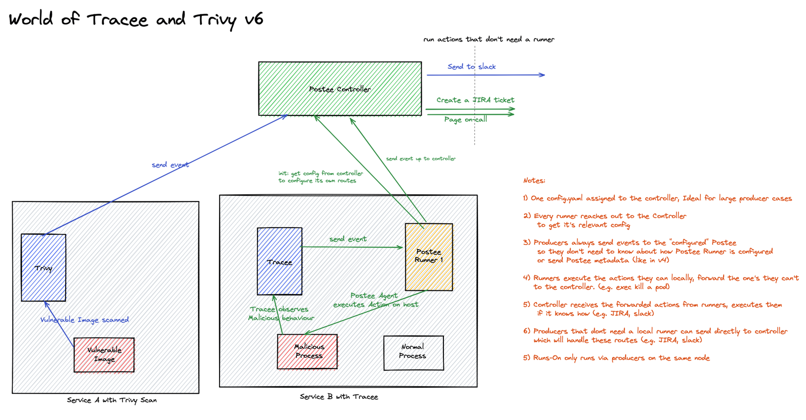

# Controller Runner Mode

## Introduction
Postee can also be run in Controller/Runner mode. The idea is to decouple enforcement from execution, where applicable.

## Scenario
In the following scenario, consider two services: A and B. In the case of Service A, a Trivy scan is run and results of the scan result are sent to Postee for executing Actions upon.

In the case of Service B, a Tracee container is constantly monitoring for malicious activity that happens on the host. When a Tracee finding is observed, it is sent to a local Postee Runner. This Postee Runner has the ability to locally execute a pre-defined Postee Action.



## Walkthrough
In the case of Tracee reporting a malicious finding, the Action might only make sense to run locally within the same environment where Tracee reported from. For instance, in the case of a Postee Action to kill a process reported within the malicious finding, the process will only exist on the host where Tracee reported from. Therefore, the need for a localized Postee that can handle this arises.

Postee Runners can automatically bootstrap themselves upon startup, given the address of the Postee Controller. They only receive the relevant config info from the Postee Controller for the Actions and Routes they are responsible for. This helps by limiting the spread of secrets in your configuration to only those Runners where they are needed. If your deployment uses Actions where secrets are required, we recommend you run these Actions at the Controller level.

The only Actions that a Postee Runner should run are Actions that are context/environment specific. A few examples (but not limited to) are: Killing a local process, Shipping local logs on host to a remote endpoint, etc.

## Additional Info
Postee Runners and Controllers are no different from a normal instance of vanilla Postee. Therefore, no changes to the producers are required to use this functionality.

All events received by Postee Runners are reported upstream to the Controller. This has two benefits:
1. Executions and Events received by the Runners can be monitored at a central level (Controller).
2. Mixing of Runner and Controller Actions within a single Route, for ease of usage.

Mixing of Runner and Controller Actions can be explained with a following sample configuration:
```yaml
- name: controller-only-route
  input: contains(input.image, "alpine")
  actions: [my-slack-message-from-controller]
  template: raw-json

- name: runner-only-route
  input: contains(input.SigMetadata.ID, "TRC-1")
  serialize-actions: true
  actions: [my-exec-from-runner, my-http-post-from-runner]
  template: raw-json

- name: controller-runner-route
  input: contains(input.SigMetadata.ID, "TRC-2")
  serialize-actions: true
  actions: [my-exec-from-runner, my-http-post-from-runner, my-jira-ticket-from-controller]
  template: raw-json
```

In this sample configuration, we have three routes. One that solely executes on the Controller, another that solely executes on the Runner and a Mixed route.

In the case of the Mixed route, the first two Actions are run on the Runner. These Actions are run locally as they might require environment specific things to run, as discussed above. The third Action is run from a Controller because of security reasons to not distribute secrets to a Runner. 

#### A quick note on Serialization
The option of `serialize-actions` works as expected and guarantees true serialization for execution of Actions in the case of Controller only and Runner only routes. But for the case of Mixed routes (as described above) where executions can run on both Controller and Runner, this serialization cannot be strongly guaranteed due to the difference of execution environments (Runner and Controller).
