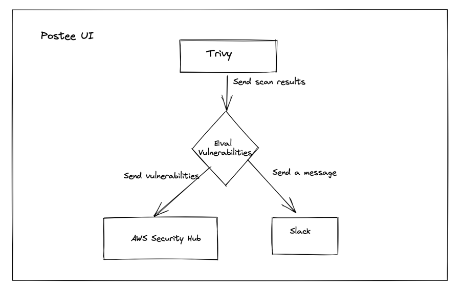

# Improvements

Postee like any other software isn't perfect and as the writing of this document can be improved in the following areas:

## UI

This is an improvement that would benefit not just new users of Postee but also add ease of use for existing users to configure Postee on the fly with drag and drop-'ing of components to configure Postee.

The above is an example of a User Interface that Postee could have where the blocks (Trivy, AWS Security Hub and Slack) are dragged and dropped into the view and connected as needed. This would translate into a Postee configuration file being written to disk.

## Alternate Policy language

Today Postee supports Rego as the primary language for policy evaluation. While Rego is purposely suited for being a policy language, it might be challenging to learn for new users and feel comfortable in. 

Therefore, having an alternate policy language to write rules could benefit with Postee adoption even further. A few ideas that we've experimented in some of our other projects are as follows:

1. Golang Policies
2. [CEL-Go](https://github.com/google/cel-go)

## Support for more Actions

Today Postee supports a wide variety of Postee Actions but the list can be further expanded by including the following:

1. AWS Cloudwatch Logs
2. Azure automation
3. GCP automation

Extending Postee to support a new Action is very simple. You can take a look at this PR to see exactly which places you'll need to modify in order to support a new Action. 

[Link to example PR](https://github.com/aquasecurity/postee/pull/468)

## My idea is not listed here
Do you have an idea that you'd like to implement in Postee? Reach out to us via GitHub Issues or on Slack to discuss more about it.
