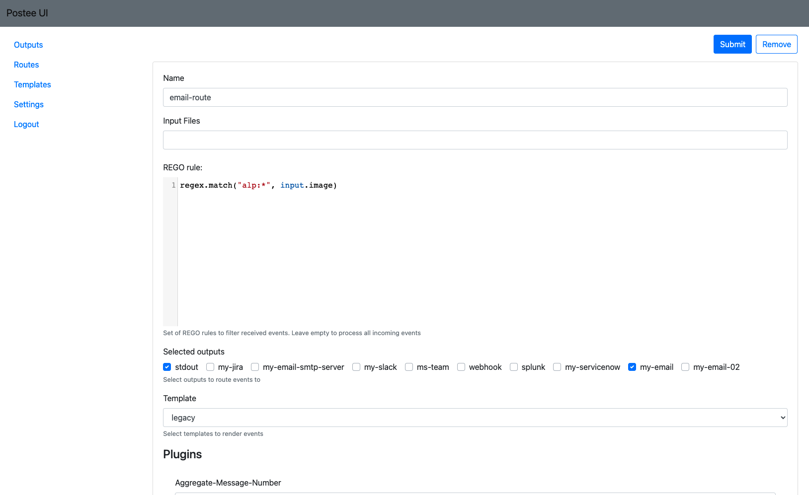

A route is used to control message flows. Each route includes the input message condition, the template that should be used to format the message, and the action(s) that the message should be delivered to.

The most important part of a route is the **input definition using the Rego language** to define what are the conditions for an incoming message to be handled by a certain route.



!!! tip
    See the complete Rego Language in [OPA-reference](https://www.openpolicyagent.org/docs/latest/policy-reference/#built-in-functions)

After defining the route's input condition, what is left is to define the template that will be used to format the input message, and the action that formatted message will be sent to.

The below table describes the fields to define a route:

Key | Description | Possible Values                                       | Example
--- | --- |-------------------------------------------------------| ---
*name*|Unique name of route| string                                                | teams-vul-route
*input*|A Rego rule to match against incoming messages. If there is a match then this route will be chosen for the incoming message| Rego language statements                              | contains(input.message,"alpine")
*input-files*|One or more files with Rego rules| Set of Rego language files                            | ["Policy-Registry.rego", "Policy-Min-Vulnerability.rego"]
*actions*|One or more actions that are defined in the "actions" section| Set of action names. At least one element is required | ["my-slack", "my-email"].
*serialize-actions*|Serialize the list of actions| true, false(default)                                  |true
*template*| A template that is defined in the "template" section| any template name                                     | raw-html

The `rego-filters` folder contains examples of policy related functions. You can use the examples. To do this, you need to change the input data in the arrays of rego files and fill in the config file. If you want to use an other folder, set the 'REGO_FILTERS_PATH' environment variable to point to it. When using 2 or more files, they will be combined by "OR".
To combine policy related functions by "AND", use the `Policy-Related-Features.rego` file, change the input data, and fill in the required function in allow.
```
allow{
    PermitImageNames
    PermitMinVulnerability
}
```
If you are using your own rego files, then the **package** field should be "postee" and the result should be in the  **allow** function:
```
package postee

your_function{...} # 0 or more your functions

allow {
    your_function
}
```
For example, the following input definition will match JSON messages that have 'image.name' field with value that contains the string 'alpine':

```
input: contains(input.image,"alpine")
```

Another example using regular expression:
```
input: regex.match("alp:*", input.image)
```

You can create more complex input definitions using the Rego language. For example, the following input definition will match JSON messages that have 'image.name' field with value 'alpine' and that their registry is 'Docker Hub' and they have a critical vulnerability.

```
input: |
  contains(input.image,"alpine")
  contains(input.registry, "Docker Hub")
  input.vulnerability_summary.critical>0
```

## Postee Route Configuration

You could use Postee with any json. See the following example receiving json events:

### Route All Messages
To create a route that matches all messages, simply use the following:

```
routes:
- name: catch-all
  input: input
  ...
```

### Route Drift Prevention Messages
To create a route that matches only messages that originated from a "Drift Prevention" event, use the following:

```
routes:
- name: catch-drift
  input: contains(input.control, "Drift")
  ...
```

### Route Tracee Message

The following input JSON message is from [Tracee](https://github.com/aquasecurity/tracee).

Set `input` property of route to: `contains(input.SigMetadata.ID,"TRC-")` to limit the route to handle Tracee messages only

In the section [rego-templates](https://github.com/aquasecurity/postee/tree/main/rego-templates) have rego templates samples to use with Tracee:
- tracee-html.rego
- tracee-slack.rego

### Plugins

'Plugins' section contains configuration for useful Postee features.

Key | Description | Possible Values | Example
--- | --- | --- | ---
*aggregate-message-number*|Number of messages to aggregate into one message.| any integer value | 10
*aggregate-message-timeout*|number of seconds, minutes, hours to aggregate|Maximum is 24 hours Xs or Xm or Xh | 1h
*unique-message-props*|Optional. Comma separated list of properties which uniquely identifies an event message. If message with same property values is received more than once, consequitive messages will be ignored. | Array of properties that their value uniquely identifies a message | To avoid duplicate scanning messages you can use the following properties: ```unique-message-props: ["digest","image","registry", "vulnerability_summary.high", "vulnerability_summary.medium", "vulnerability_summary.low"]```
*unique-message-timeout*|Optional. Used along with *unique-message-props*, has no effect if unique props are not specified. Number of seconds/minutes/hours/days before expiring of a message. Expired messages are removed from db. If option is empty message is never deleted | 1d
