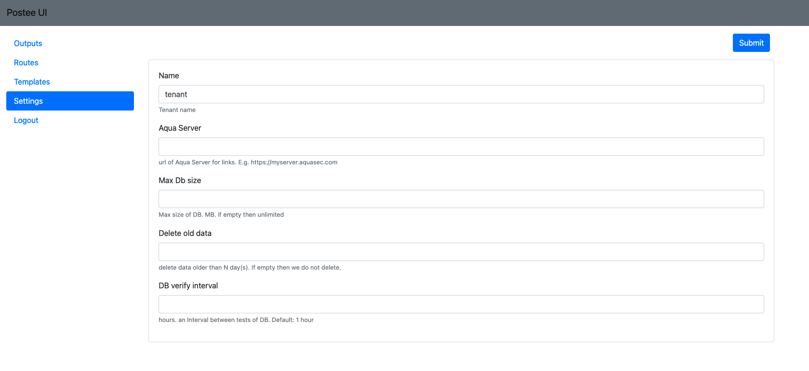

General settings are specified at the root level of cfg.yaml. They include general configuration that applies to the Postee application.

Key | Description                                                                                                                                                                          | Possible Values | Example Value
--- |--------------------------------------------------------------------------------------------------------------------------------------------------------------------------------------| --- | ---
*aqua-server*| Aqua Platform URL. This is used for some of the integrations to will include a link to the Aqua UI                                                                                   | Aqua Platform valid URL | https://server.my.aqua
*db-verify-interval*| Specify time interval (in hours) for Postee to perform database cleanup jobs. Default: 1 hour                                                                                        | any integer value  | 1
*max-db-size*| The maximum size of Postee database (in B, KB, MB or GB). Once reached to size limit, Postee will delete old cached messages. If empty then Postee database will have unlimited size | any integer value with a unit siffux | 200kb, 1000 MB, 1Gb

