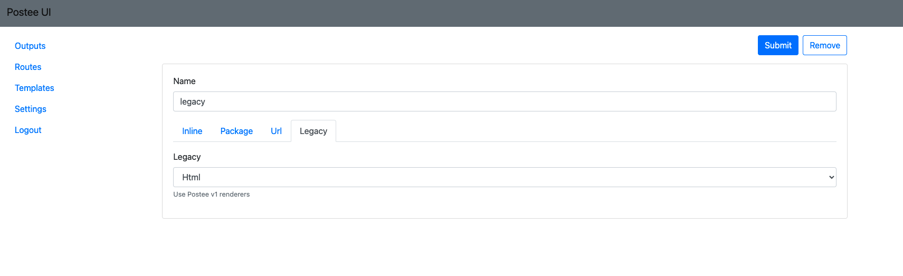

Templates are used to format input messages before sending them to the action. For example - before sending a message to Microsoft Teams there is a need to format the input JSON into an HTML. This is done using a template.

Each template has a `name` field, which is used by the route to assign the template to input and output.

!!! tip
    Use the default Legacy template "html" for general output



In addition to name, a template will have **one** of the 4 below keys:

Key | Description | Example
--- | --- | ---
*rego-package*|Postee loads bundle of templates from `rego-templates` folder. This folder includes several templates shipped with Postee, which can be used out of the box. You can add additional custom templates by placing Rego file under the 'rego-templates' directory.| `postee.vuls.html`
*body*| Specify inline template. Relative small templates can be added to config directly | input
*url*| Load from url. Rego template can be loaded from url.| http://myserver.com/rego.txt
*legacy-scan-renderer*| Legacy templates are introduced to support Postee V1 renderers. Available values are  "jira", "slack", "html". "jira" should be used for jira integration, "slack" is for slack and "html" is for everything else. | html

!!! tip 
    Pre made examples for templates can be found [here](https://github.com/aquasecurity/postee/tree/main/rego-templates)

### Customizing Templates
It is possible to customize templates and even write new ones from scratch. Follow the guide in our advanced section here: [Customizing Templates](advanced.md#Customizing Templates)

### Troubleshooting of Rego Templates

Rego templates provide very flexible way for transformation of received json. You can convert received information to html or json.
On the flip side sometimes it may be difficult to find root cause of issue (if you run into any while configuring custom template).
Postee application doesn't have many options to provide detailed error message. Very often if something goes wrong then 'result' property is omitted from rego evaluation result and it causes errors like:
```
2021/07/23 18:27:31 Error while evaluating input: property result is not found
```
So here are details to help with troubleshooting:
#### Required tools
- [opa](https://www.openpolicyagent.org/docs/latest/#running-opa) - tool to evaluate OPA queries directly
- [jq](https://stedolan.github.io/jq/) - flexible command-line JSON processor.

#### Evaluate template to build html
Here is example of command to evaluate rego:
```
opa eval data.postee.vuls.html.result --data vuls-html.rego --data common/common.rego --input <path to input json> | jq -r .result[0].expressions[0].value
```
The example above should be started in `rego-templates` folder and evaluates default html template shipped with postee. First opa argument is query. Three parts are used to build query `data`.`<your rego package>`.`result`. You may want to evaluate title property. In this case query would be: `data`.`<your rego package>`.`title`

#### Evaluate template to build json

```
cd rego-templates
opa eval data.postee.vuls.slack.result --data vuls-slack.rego --data common/common.rego --input <path to input json> | jq .result[0].expressions[0].value
```

The command above is similar to html case but `jq` is used a bit different way.
